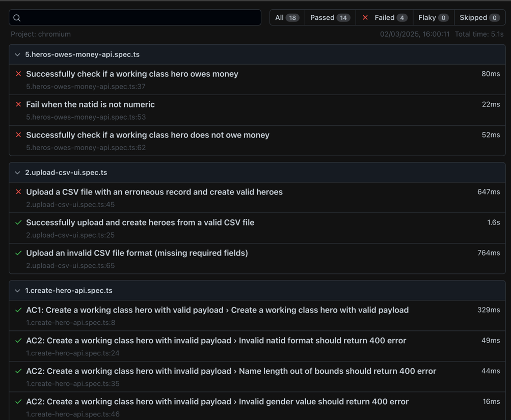

# 🦸‍♂️ Playwright Automation for Working Class Hero Application

This repository contains automation test cases for the **Working Class Hero** application, built using the **Playwright** automation tool. The tests cover various use cases such as creating heroes, validating their data, working with vouchers, processing CSV files, and ensuring database consistency.

## 📋 Table of Contents

- [Test Scenarios & Acceptance Criteria](#test-scenarios--acceptance-criteria)
    - [AC1: Create Working Class Hero with Valid Payload](#ac1-create-working-class-hero-with-valid-payload)
    - [AC2: Create Working Class Hero with Invalid Payload](#ac2-create-working-class-hero-with-invalid-payload)
    - [AC3: Handle Duplicate natid](#ac3-handle-duplicate-natid)
    - [AC4: Verify Database Consistency](#ac4-verify-database-consistency)
    - [AC5: Tax Relief File Generation](#ac5-tax-relief-file-generation)
    - [AC6: Handling Vouchers](#ac6-handling-vouchers)
    - [AC7: API Response Validation for Hero Status](#ac7-api-response-validation-for-hero-status)
- [Setup & Installation](#setup--installation)
- [Running the Tests](#running-the-tests)
- [Folder Structure](#folder-structure)
- [Test Dependencies](#test-dependencies)

---

## 📝 Test Scenarios & Acceptance Criteria

### ✅ AC1: Create Working Class Hero with Valid Payload

**Scenario**: A working class hero is created with a valid payload containing all necessary fields. The hero is successfully created, and a confirmation message is returned.

#### Test Steps:
- ✅ Generate hero data using `WorkingClassHeroBuilder`.
- ✅ Send a valid payload to the API.
- ✅ Verify the response contains a success message and timestamp.
- ✅ Ensure the hero is added to the database.

#### Test Coverage:
- ✅ Verify the correct response status (200 OK).
- ✅ Confirm that the hero is created in the database.

---

### ❌ AC2: Create Working Class Hero with Invalid Payload

**Scenario**: Various invalid payloads are tested to ensure proper error handling by the API.

#### Test Cases:
1. ❌ **Invalid natid format** should return a 400 error with the message `Invalid natid`.
2. ❌ **Empty name** should return a 400 error with messages indicating invalid name.
3. ❌ **Invalid gender** value should return a 400 error with the message `Invalid gender`.
4. ❌ **Negative salary** should return a 400 error with the message `Salary must be greater than or equals to zero`.
5. ❌ **Nullable fields** (e.g., `browniePoints` and `deathDate`) should not cause errors.

#### Test Coverage:
- ✅ Test invalid `natid`, `name`, `gender`, and `salary`.
- ✅ Ensure validation is in place for empty fields and unsupported values.

---

### 🔄 AC3: Handle Duplicate natid

**Scenario**: Ensure the system rejects the creation of a hero with a duplicate `natid`.

#### Test Steps:
- ✅ Create a hero with a specific `natid`.
- ✅ Attempt to create another hero with the same `natid`.
- ✅ Verify that the system responds with a 400 error and an appropriate error message indicating the duplicate.

#### Test Coverage:
- ✅ Verify that a duplicate `natid` results in a failure message.
- ✅ Ensure the system prevents multiple heroes with the same `natid`.

---

### 🗄️ AC4: Verify Database Consistency

**Scenario**: Ensure the data for newly created heroes is correctly stored in the database.

#### Test Steps:
- ✅ Create a hero using the API.
- ✅ Query the database to check if the hero's data matches the created hero.

#### Test Coverage:
- ✅ Verify that the `natid` of the hero exists in the database.
- ✅ Ensure that no discrepancies are found in the stored data.

---

### 📂 AC5: Tax Relief File Generation

**Scenario**: Verify the generation and validation of the tax relief file.

#### Test Steps:
- ✅ Login as a Book Keeper and generate the tax relief file.
- ✅ Verify that the file is successfully created and downloaded.
- ✅ Ensure the file contains records in the format `<natid>,<tax relief amount>`.
- ✅ Validate that the database contains an entry for the generated file.

#### Test Coverage:
- ✅ Validate the format and existence of the downloaded file.
- ✅ Ensure that the correct number of records are persisted in the database.

---

### 🎫 AC6: Handling Vouchers

**Scenario**: Test the creation of heroes with vouchers, as well as the retrieval and validation of voucher counts.

#### Test Steps:
1. ✅ Create a hero with a set of vouchers (multiple `TRAVEL` and `FOOD` vouchers).
2. ✅ Retrieve and validate the voucher counts for the created hero.

#### Test Coverage:
- ✅ Verify the correct creation of heroes with vouchers.
- ✅ Ensure the voucher counts are accurate and match the expected values (5 `TRAVEL`, 5 `FOOD`).

---

### 📊 AC7: API Response Validation for Hero Status

**Scenario**: Ensure that the API correctly identifies whether a hero owes money and returns the correct response.

#### Test Steps:
- ✅ Create a hero and check if they owe money using the API.
- ✅ Validate the response structure, including the status (`OWE` or `NIL`).
- ✅ Test invalid `natid` formats to ensure proper error handling.

#### Test Coverage:
- ✅ Verify that the API returns the correct status (`OWE` or `NIL`) based on the hero's data.
- ✅ Ensure that invalid `natid` values trigger appropriate errors.

---

## ⚙️ Setup & Installation

To run the tests, you'll need to have the following installed:

- **Node.js** (v16 or higher)
- **Playwright** (for browser automation)

### Steps to Set Up

1. **Clone the repository**:
   ```bash
   git clone https://github.com/afsarali273/Govtech-MCF.git
   cd Govtech-MCF
   ```
   
2. **Run Test**
    ```bash
   npm install
   npm run test
   ```

Folder Structure
```html
├── page-object/                        # Contains the Page Object Model (POM) files
│   ├── base-page.ts                    # Base class for common actions across pages
│   ├── dashboard.page.ts              
│   ├── login.page.ts                  
├── playwright-report/                  # Test execution reports generated by Playwright
│   └── index.html                      
├── tests/
│   ├── 1.create-hero-api.spec.ts         
│   ├── 2.upload-csv-ui.spec.ts           
│   ├── 3.tax-relief-egress.spec.ts    
|   ├── 4.create-hero-with-voucher-api.spec.ts
|   ├── 5.heros-owes-money-api.spec.ts
|   └── 6.system-owner-voucher-check-api.spec.ts
├── utils/
│   ├── data/
│   │   └── working-class-heros-builder.ts # Helper classes to build hero data
│   ├── api-endpoints.ts                  # API endpoint constants
│   ├── ApiUtils.ts                       # Utility methods for making API requests
│   ├── CommonUtils.ts                    # Common utilities used across tests
│   └── DatabaseUtil.ts                   # Database utilities for verifying data
├── .env                                  # Environment variables for the tests
├── package.json
└── playwright.config.ts                  # Playwright configuration

```

**Test Results:**


